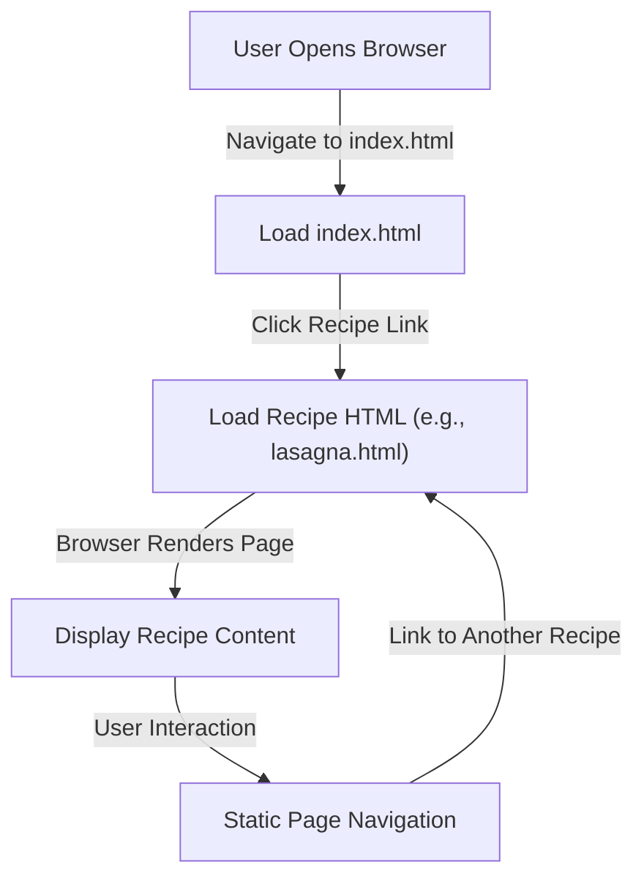

# Technical Architecture Document: Unheat/odin-recipes

## Part 1: Architecture Summary

### 1. Project Purpose & Domain
This codebase is a static website for displaying recipes. It operates in the domain of culinary content presentation, specifically providing web pages for individual recipes (e.g., lasagna, pho). The project appears to be a simple, client-side only application with no server-side processing or dynamic content generation.

### 2. High-Level Architecture Pattern
The architecture is a **static site** pattern, which is a form of a client-side monolith. There is no evidence of server-side frameworks, microservices, or event-driven systems. The structure consists of a root `index.html` (likely a homepage or listing page) and a `recipes/` directory containing individual recipe pages. This is a flat, file-based structure typical of static HTML sites.

**Evidence from tree:**
- `index.html` at root: likely the entry point or navigation hub.
- `recipes/` directory: contains specific recipe pages (`lasagna.html`, `pho.html`), indicating a modular but static content organization.

### 3. Module Breakdown
- **Root Directory (`/`)**:
  - `index.html`: Serves as the main entry point or homepage. Likely provides navigation to recipe pages or a listing of available recipes. Relationships: links to `recipes/lasagna.html` and `recipes/pho.html`.
- **`recipes/` Directory**:
  - `lasagna.html`: A static HTML page dedicated to the lasagna recipe. Responsibility: display ingredients, instructions, and media for lasagna. Relationships: referenced from `index.html`.
  - `pho.html`: A static HTML page dedicated to the pho recipe. Responsibility: display content for pho. Relationships: referenced from `index.html`.

No other directories or modules are present, indicating a minimal, content-focused structure.

### 4. Data Flow
Data flow is entirely client-side and static:
1. **Entry Point**: User accesses `index.html` via a web browser.
2. **Navigation**: `index.html` likely contains hyperlinks to `recipes/lasagna.html` and `recipes/pho.html`.
3. **Content Delivery**: When a user clicks a link, the browser loads the respective HTML file directly from the server (or local file system). No server-side processing, middleware, or repositories are involved.
4. **Rendering**: Each HTML file is rendered by the browser, displaying text, images (if linked), and structure. There is no dynamic data manipulation, API calls, or backend services.

This flow is inferred from the static HTML files and lack of any server-side code or configuration files.

### 5. Key Technical Dependencies
No dependency files (e.g., `package.json`, `go.mod`, `requirements.txt`) are present in the tree. The project appears to rely solely on standard web technologies (HTML, possibly CSS/JS if linked within HTML files, but not evidenced in the tree). Therefore, there are no explicit third-party dependencies indicated.

### 6. Cross-Cutting Concerns
- **Auth**: Not applicable; no authentication mechanisms are evident in the static structure.
- **Logging**: Not applicable; no server-side or client-side logging frameworks are present.
- **Config**: No configuration files (e.g., `.env`, `config.json`) are in the tree. Configuration is likely minimal or handled via HTML meta tags.
- **Error Handling**: No evidence of structured error handling (e.g., custom 404 pages). Errors would be handled by the browser's default behavior for missing files.

## Part 2: Mermaid Flowchart

The following flowchart illustrates the primary data flow for a user accessing a recipe page. It is based on the static site pattern inferred from the file tree.

