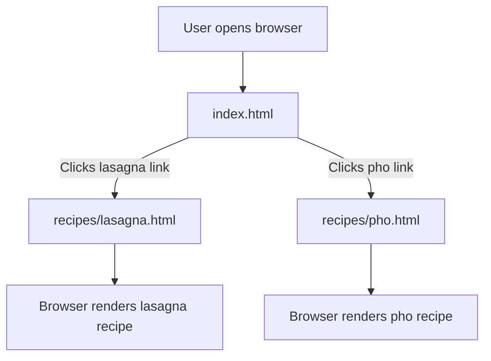

# Technical Architecture Document: odin-recipes

## Part 1: Architecture Summary

### 1. Project Purpose & Domain

This codebase is a static recipe website, likely built as a learning exercise as part of The Odin Project curriculum (evidenced by the repository name `odin-recipes`). The domain is food/cooking, presenting individual recipe pages for dishes such as lasagna and pho.

### 2. High-Level Architecture Pattern

The architecture is a **static site** composed entirely of plain HTML files with no build system, server-side logic, or client-side framework evident from the file tree. There is no JavaScript, CSS, or configuration file present in the tree, suggesting this is a minimal, content-only HTML project.

Evidence:
- The root contains only `index.html`.
- The `recipes/` directory contains individual `.html` files, one per recipe.
- No `package.json`, `requirements.txt`, `go.mod`, or any other dependency/build manifest is present.

### 3. Module Breakdown

| Module / Path | Responsibility | Relationships |
|---|---|---|
| `index.html` | Serves as the landing page and likely the navigation hub linking to individual recipe pages. | Links to files within `recipes/`. |
| `recipes/` | Contains individual recipe pages, each representing a single dish. | Each file is likely linked from `index.html`. |
| `recipes/lasagna.html` | Presents the lasagna recipe content. | Linked from `index.html`. |
| `recipes/pho.html` | Presents the pho recipe content. | Linked from `index.html`. |

### 4. Data Flow

Given that this is a purely static HTML site, the data flow is minimal and entirely browser-driven:

1. A user opens `index.html` in a browser.
2. `index.html` likely contains hyperlinks (`<a>` tags) pointing to recipe pages in the `recipes/` directory.
3. The user clicks a link, and the browser navigates to the corresponding recipe HTML file (e.g., `recipes/lasagna.html`).
4. The recipe page renders its content directly from the static HTML.

There are no servers, APIs, databases, middleware, or dynamic data sources evident in the file tree. All content is statically authored in HTML.

### 5. Key Technical Dependencies

No dependency manifests (e.g., `package.json`, `Gemfile`, `requirements.txt`) are present in the file tree. The project has **zero external dependencies** based on available evidence. The only technology required is a web browser capable of rendering HTML.

### 6. Cross-Cutting Concerns

- **Configuration**: No configuration files are present. The site requires no build or deployment configuration beyond serving static files.
- **Styling**: No CSS files are present in the tree. Styling is either absent, inline within the HTML files, or relies on browser defaults. The tree is insufficient to determine which.
- **Authentication/Authorization**: Not applicable. This is a public static site with no user-facing auth.
- **Logging/Error Handling**: Not applicable. There is no server-side or client-side logic evident.
- **Routing**: Routing is handled entirely through static file paths and HTML hyperlinks. There is no client-side router or server-side routing logic.

## Part 2: Mermaid Flowchart

